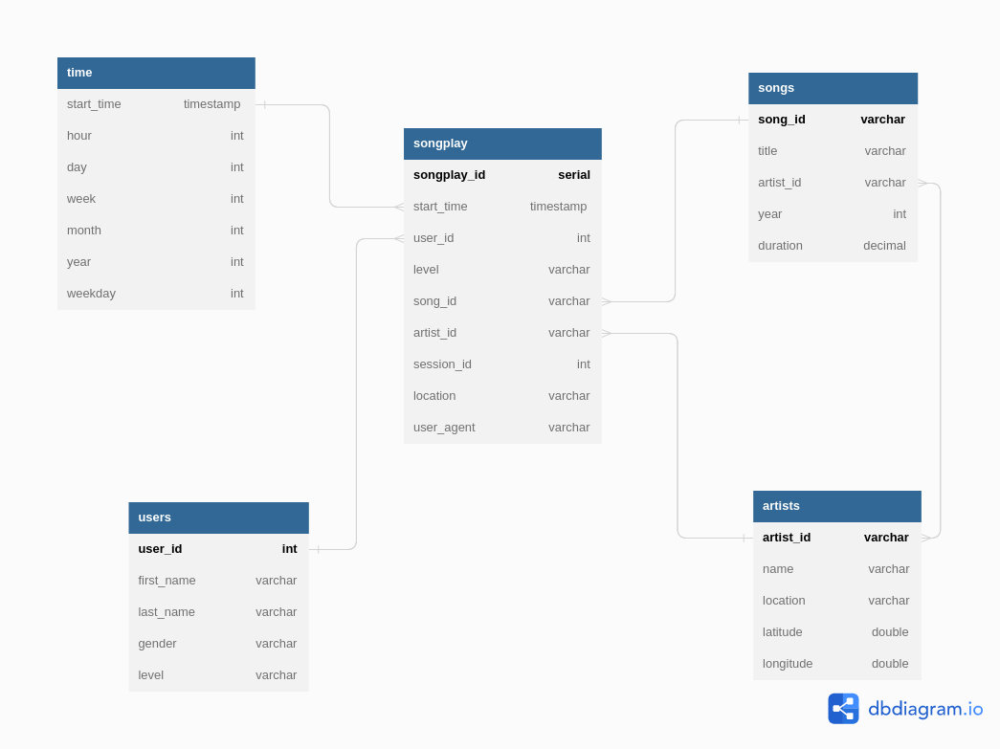

# PROJECT-1: Data Modeling with Postgres

## Overview

The goal of this project is to to create a Postgres database designed to optimize queries for the analytics team of a music streaming company, Sparkify. The ETL pipeline consists on fetching data from JSON files, process the data, and insert it into the database. 

---

## Repository

There are two repositories from which our data is retrieved:
* song_data: contains 80 files. Each file is in JSON format and contains metadata about a song and the artist of that song. 
* log_data: contains 31 files. Each files is a JSON format generated by an event simulator from a music streaming app based on specified configurations. 

---

## Database

Sparkify schema has a star design where one fact table (songplays) references 4 other dimension tables (songs, artists, time and users).

The scheme goes as follows:

--- 

## ETL

The main ETL file, etl.py works as follows:

* Get the list of all individual JSON files in song_data and log\_data directories.
* Convert each file data in song\_data directory into a dataframe, select the fields needed insert into _songs_ and _artists_ tables. 
* Convert each file data in log\_data directory into a dataframe, filter dataframe by NextSong in "page" column. Select and process "ts" column to insert into _time_ table. Select the fields needed to insert into _users_ table. And finally, use the query (that fills the fields artistid and songid using the song title and artist name) to insert log information in _songplays_ table. 

Uppon running it, we have that:
* songplays: 12544
* users: 96
* songs: 71
* artists: 69
* There was only one match for the song_select query, which means that only one log was a song in songs table.
